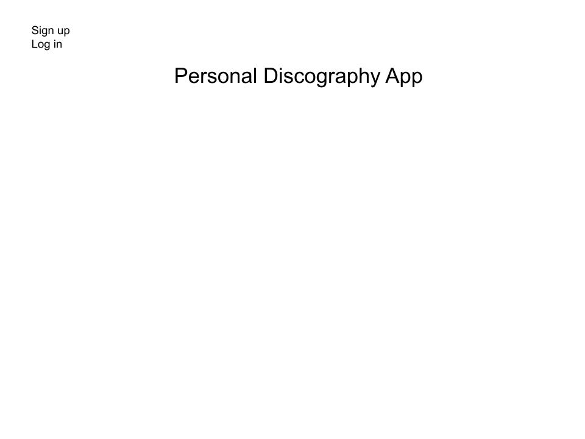
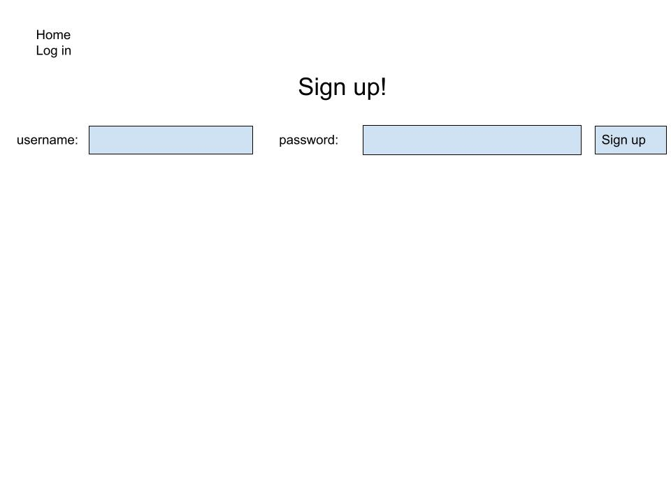

# PROJECT TWO

## Disclaimer

I am way behind. I need to understand APIs a little better to be able to plan my project.

I have been working this morning on a concept that I believe will have a solid foundation that will be obtainable, while keeping a stretch goal list that can make the app something I am actually proud of. I was hoping to have it done before the css lecture. Since I didn't make that goal, I will be extremely brief and explain the concept for now.

MVP goals: A discussion forum for poker players to submit hands they have played and a comment section for advice/analysis. 

STRETCH goals: The real idea I have been trying to formulate, with minimal success, is a poker tournament organization tool. This will require a form for setting up a tournament, with a countdown clock, a player tracker, and a blinds calculator. 

Update: again I think I have underestimated the complexity of my idea. I am going to ease up a bit and limit my stretch goals to adding a comment and leave my mvp without user comments.

POKER API: https://www.pokerapi.dev/
-current api remains untested.

## __MVP__

1. home page with welcome message, nav bar, and a description paragraph.
2. Log in page for users to connect to their profile.
3. Sign up page for new users.
4. New hand page for users to post their hand to the site (form).
5. Profile page for users to view hand library.

## __STRETCH__

1. Comment section for users to give advice to other users
2. User profile pic.
3. Friends function within the app.

## __WIRE-FRAMES__

