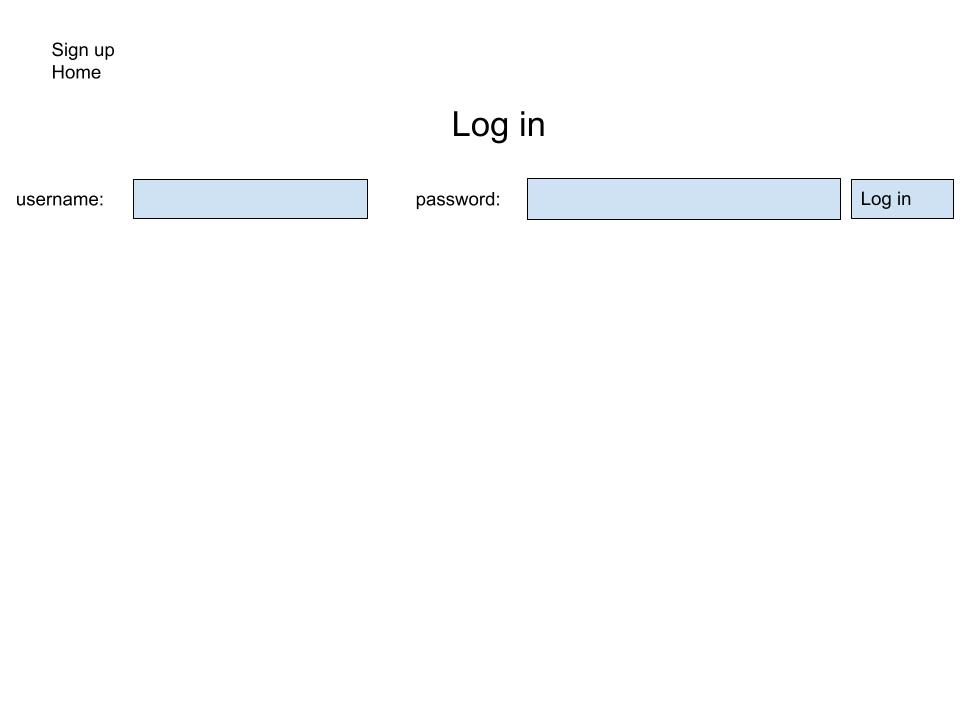
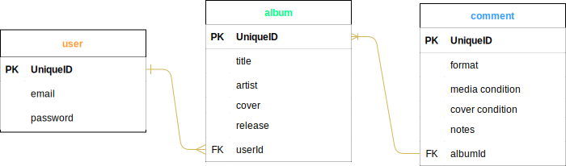

# PROJECT TWO

## __Overview__

* This is an app where a user can log into their account and search and store information about vinyl records. Users will be able to record the condition of their vinyl in their collection. The app will utilize the AudioDB api and potentially the discogs api for stretch goals.  

## __User stories__

* As a user I want to be able to search for information related to albums released by my favorite musical artists.

* As a user I want to be able to keep a list of all of my records so I have a handy list of all my music.

* As a user I want to record the format of my music (vinyl, tape, cd, etc.), the condition of the media, the condition of the case/cover, and any notes I want to make about each record. For example: if its a rare pressing or if its autographed, anything that isn't in one of the listed catagories.

## __API__

[discogs api] (http://www.discogs.com/developers/)

## __MVP__

1. home page with welcome message, nav bar, and a description paragraph.
2. Log in page for users to connect to their profile.
3. Sign up page for new users.
4. Search page for users find album data and to add albums to their library.
5. Profile page for users to view record library.
    * albums should include a remove button.
    * albums should include a details button.
    

## __STRETCH__

1. CSS. Once functionality is achieved, styling is the first stretch priority. 
2. Five star album rating system using radio buttons, and drop boxes for condition catagories (i.e. mint, near mint, very fine, etc.).
3. User profile pic.
4. Add functionality to import users actual discogs collection so they don't have to search one by one if they already are Discogs members.

## __WIRE-FRAMES__

.jpg)

## __ERD__

## __models__

sequelize model:create --name user --attributes name:email,password:string,albumId:integer

sequelize model:create --name album --attributes title:string,artist:string,release:DATE,cover:integer,note:string

## __CRUD__
CRUD | verb   |  path    |     description              |
-----|--------|----------|------------------------------|
C    | POST   | /sign-up | create new user              |
R    | GET    | /search  | retrieve album info from api |
U    | PUT    | /profile | add album to profile         |
D    | DELETE | /profile | remove album from profile    |
